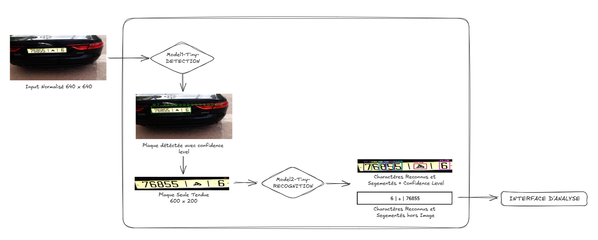
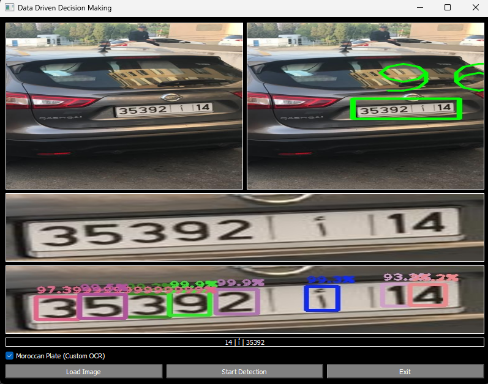

# Pipeline Intégré de Reconnaissance de Plaques d'Immatriculation Marocaines


|:-----------------------------:|
| Pipeline Du Projet |


|:-----------------------------:|
| Exemple de Test sur l'application finale |

## Description du Projet

Ce projet vise à développer un système complet de reconnaissance de plaques d'immatriculation marocaines, en se concentrant sur les aspects de détection et de reconnaissance des caractères. Le système repose sur une architecture en pipeline combinant les modèles YOLOv2, YOLOv3 en leurs variantes allégées (Tiny) pour fournir une solution robuste, rapide et adaptable aux contraintes du monde réel. Il est conçu pour être utilisé dans des contextes tels que la gestion du stationnement, la surveillance du trafic et le contrôle d'accès sécurisé.

## Table des Matières

* [Description du Projet](#description-du-projet)
* [Jeux de Données (Datasets)](#jeux-de-données-datasets)
* [Modèles YOLO](#modèles-yolo)
* [Pipeline Proposé](#pipeline-proposé)
* [Résultats et Analyse](#résultats-et-analyse)
* [Installation et Configuration](#installation-et-configuration)
* [Utilisation](#utilisation)
* [Conclusion](#conclusion)
* [Contribuer](#contribuer)
* [Licence](#licence)

## Jeux de Données (Datasets)

Le projet s'appuie sur deux jeux de données principaux pour entraîner et évaluer les modèles :

### Dataset 1 : Détection des Plaques

* *Nombre d'images* : 1601
* *Format des annotations* : YOLO (classe, x\_center, y\_center, width, height)
* *Sources* : Caméras de surveillance, images en conditions réelles marocaines

### Dataset 2 : Reconnaissance des Caractères

* *Nombre d'images* : 800 (après augmentation : 1200)
* *Classes supportées* : 0-9, a-z, caractères arabes spécifiques
* *Format des annotations* : YOLO et XML

## Modèles YOLO

Le projet utilise plusieurs versions des modèles YOLO, chacune optimisée pour des cas d'utilisation spécifiques :

| Version | Backbone   | FPS | mAP (COCO) | Innovations                                       |
| ------- | ---------- | --- | ---------- | ------------------------------------------------- |
| YOLOv2  | Darknet    | 45  | 63.4       | Détection rapide, architecture simplifiée         |
| YOLOv3  | Darknet-53 | 30  | 57.9       | Feature Pyramid Network, prédiction multi-échelle |

La version Tiny de YOLOv3 est également utilisée pour des contraintes de ressources limitées, comme les dispositifs embarqués.

## Pipeline Proposé

Le pipeline de traitement des images est divisé en trois étapes principales :

1. *Détection des Plaques*

   * Entrée : Image normalisée (640×640)
   * Sortie : Coordonnées des plaques détectées sous forme de boîtes englobantes

2. *Extraction et Pré-traitement*

   * Recadrage des régions d'intérêt (ROI) autour des plaques détectées
   * Normalisation du contraste (CLAHE) pour améliorer la lisibilité des caractères

3. *Reconnaissance des Caractères*

   * Extraction des caractères individuels
   * Décodage des séquences de caractères pour générer le numéro de plaque (ex. "12345-A-47")
   * Correction heuristique pour s'adapter aux formats marocains spécifiques

## Résultats et Analyse

Les performances des différents modèles ont été mesurées sur des jeux de données réels avec les métriques standard de précision, rappel et F1-Score :

| Modèle                       | Précision | Rappel | F1-Score |
| ---------------------------- | --------- | ------ | -------- |
| Tiny YOLOv2 (Détection)      | 0.83      | 0.80   | 0.81     |
| Tiny YOLOv3 (Détection)      | 0.90      | 0.88   | 0.89     |
| Tiny YOLOv2 (Reconnaissance) | 0.76      | 0.74   | 0.75     |
| Tiny YOLOv3 (Reconnaissance) | 0.84      | 0.82   | 0.83     |

Les résultats montrent une nette amélioration des performances avec YOLOv3, notamment pour la détection des plaques grâce à l'utilisation de pyramides de caractéristiques (Feature Pyramid Network) et de prédictions multi-échelles.

## Installation et Configuration de l'application

### Prérequis

* Python 3.8+

```bash
$ python -m venv env
## -> Sous Windows
$ ./env/Scripts/activate
## -> Sous Linux
$ source ./env/bin/activate
$ pip install -r ./requirements.txt

$ python ./main.py
$ python ./api.py
$ python ./client.py 
```


## Conclusion

Ce projet démontre la faisabilité d'un système de reconnaissance de plaques en temps réel pour le contexte marocain, avec des performances robustes et une architecture adaptable à des contraintes matérielles variées. Le pipeline proposé offre une solution complète allant de la détection initiale des plaques à la reconnaissance des caractères, avec des résultats compétitifs en termes de précision et de rapidité.
